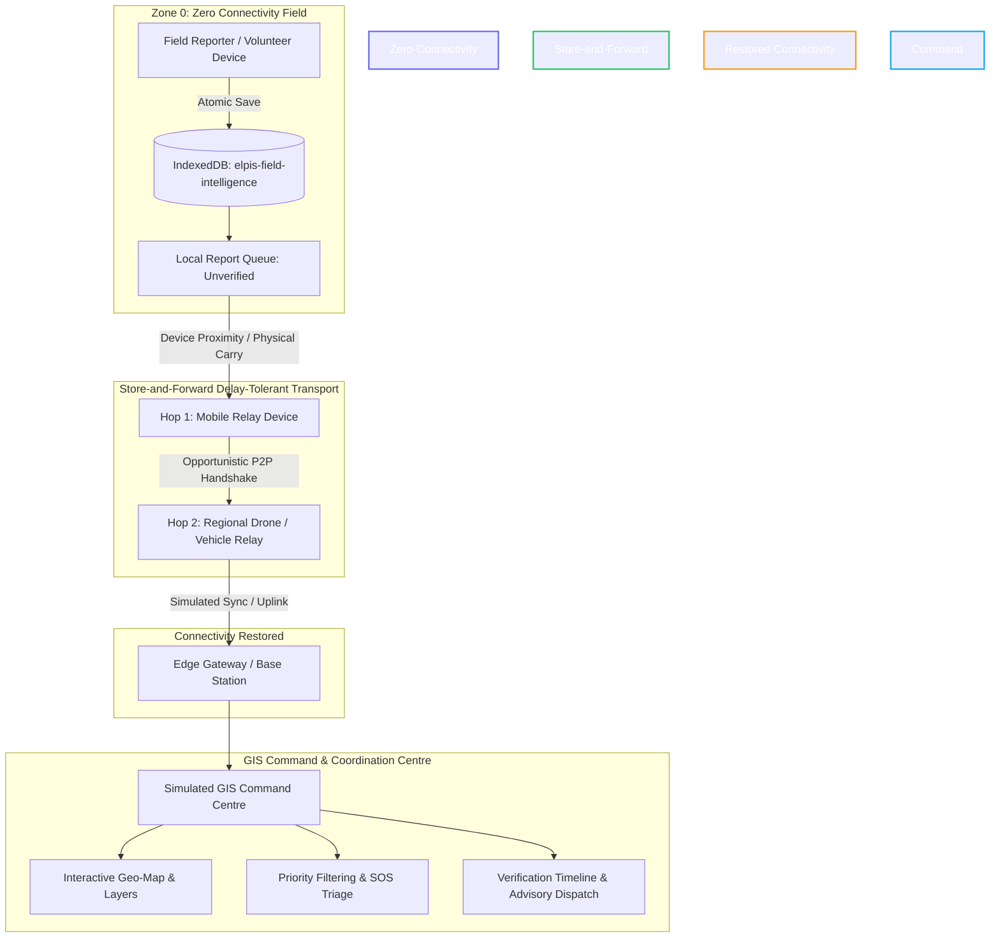

<div align="center">

# 🛰️ Project ELPIS
### Resilient Disaster Communication & Ground Intelligence

[](https://vitejs.dev/)
[](https://react.dev/)
[](https://www.typescriptlang.org/)
[](https://tailwindcss.com/)
[](https://web.dev/progressive-web-apps/)
[](https://vercel.com/)

<p align="center">
  <b>Smart India Hackathon 2026 (SIH26206)</b> · <i>Student Innovation: Disaster Management</i>
</p>

> *“When the network fails, disaster information shouldn't stop moving.”*

[Live Demo](#-deployment) • [Key Features](#-core-experiences) • [Architecture](#-system-architecture) • [Getting Started](#-getting-started) • [Safety Disclaimer](#-safety--operational-limits)

---

</div>

## 📌 Overview

**Project ELPIS** is a resilient, offline-first ground intelligence and emergency communication platform engineered for disaster scenarios where cellular networks and power grids collapse. 

By combining **local IndexedDB persistence**, an interactive **store-and-forward mesh propagation model**, and a **simulated GIS command centre**, ELPIS ensures field volunteers, responders, and coordinators can record vital observations offline and synchronize ground truth intelligence the moment partial connectivity resumes.

---

## 🗺️ System Architecture



---

## ⚡ Core Experiences

| Module | Route | Highlights |
| :--- | :--- | :--- |
| **Cinematic Overview** | `/` | Immersive introduction, 5-stage interactive data lifecycle, architectural guarantees, and humanitarian design positioning. |
| **Store-and-Forward Lab** | `/#network` | Six-stage delay-tolerant network sandbox with step controls, finite playback, packet metadata inspection, and real-time event logging. |
| **GIS Command Centre** | `/#command` | Simulated emergency operations center featuring interactive SVG map markers, zoom/layer controls, category filtering, SOS handling, local sync queue, and review workflows. |
| **Field Reporting Interface** | `/#field` | Six standardized disaster report categories, GPS coordinate detection with manual override, triage severity tags, and atomic IndexedDB local storage. |

---

## 🛡️ Offline Application Shell & Resilience

- **Service Worker Precaching (`sw.js`)**: Production build caches HTML, bundled JS/CSS, and web manifest. Once loaded, the app boots instantly with zero connectivity.
- **Atomic Browser IndexedDB**: Field reports are saved locally to `elpis-field-intelligence` database. Even on sudden power failure or browser crash, observations remain intact.
- **Embedded Local SVG GIS Engine**: Terrain, topology, facilities, and markers are rendered purely using client-side SVG and Canvas, avoiding reliance on remote tile servers (e.g. Mapbox/Google Maps).
- **Zero Remote Font/Asset Blocking**: System font fallbacks and embedded vector icons ensure 100% functionality in air-gapped environments.

---

## 🚀 Getting Started

### Prerequisites
- **Node.js**: v20+ or v22.12+ recommended
- **Package Manager**: `pnpm` (preferred) or `npm`

### Installation & Setup

1. **Clone the repository:**
   ```bash
   git clone https://github.com/Insane-Sadhin/project-elpis.git
   cd project-elpis
   ```

2. **Install dependencies:**
   ```bash
   pnpm install
   # or
   npm install
   ```

3. **Start local development server:**
   ```bash
   pnpm dev
   # or
   npm run dev
   ```
   *Application will be available at `http://localhost:5173/`*

4. **Build for production with strict type-checking:**
   ```bash
   pnpm build
   # or
   npm run build
   ```

5. **Preview production bundle:**
   ```bash
   pnpm preview
   ```

---

## ☁️ Deployment

### Deploy to Vercel in 1-Click

[](https://vercel.com/new/clone?repository-url=https://github.com/Insane-Sadhin/project-elpis)

#### Method 1: Continuous Deployment via GitHub (Recommended)
1. Push this repository to your GitHub account (`https://github.com/Insane-Sadhin/project-elpis`).
2. Log in to [Vercel](https://vercel.com).
3. Click **"Add New"** > **"Project"** and import `project-elpis`.
4. Framework Preset will be automatically detected as **Vite**.
5. Click **"Deploy"**. Any future commit pushed to `main` will automatically build and deploy!

#### Method 2: Via Vercel CLI
```bash
npx vercel
```
Follow the interactive CLI prompts to link and deploy to production:
```bash
npx vercel --prod
```

---

## 🛠️ Tech Stack

- **Framework**: [React 19](https://react.dev/) + [TypeScript](https://www.typescriptlang.org/)
- **Bundler & Tooling**: [Vite 8](https://vitejs.dev/)
- **Styling**: [Tailwind CSS v4](https://tailwindcss.com/)
- **Icons**: [Lucide React](https://lucide.dev/)
- **Storage**: Browser IndexedDB API (`idb`)
- **PWA**: Service Worker Cache API & Web App Manifest

---

## ⚠️ Safety & Operational Limits

> **Important Operational Notice**  
> ELPIS is a prototype designed to complement, not replace, authorized national and state disaster management authorities (such as **NDMA/SACHET**, **IMD**, and **CWC**).
> - SOS transmissions within this prototype are stored locally or in simulation; they **do not dispatch real emergency personnel**.
> - For life-threatening emergencies in India, dial **112** or use designated civil defense channels.
> - Full operational deployment requires verified transport protocols, authenticated server-side gateways, role-based access control (RBAC), and regulatory compliance.

---

## 📄 License

This project is licensed under the [MIT License](LICENSE).

---

<div align="center">
  <sub>Developed for Smart India Hackathon 2026 · Committed to resilient community response</sub>
</div>
